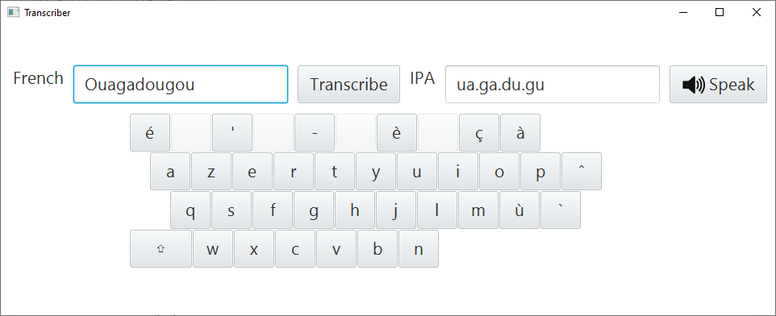

# COMP1110/6710 Assignment 1 - Transcription

## Overview

In this assignment, you will create a piece of software that transcribes
French words into the [International Phonetic Alphabet (IPA)](https://www.internationalphoneticassociation.org/sites/default/files/IPA_Kiel_2015.pdf). 
IPA is an alphabet that is entirely phonetic, meaning that each character in IPA is pronounced in only one way.
Compare this to English, which has many words that are spelled with different characters but pronounced the same (for example, 'to', 'two' and 'too').

Like any language, French is pronounced differently by different speakers.
In this assignment, you will implement a simplified set of pronunciation rules that approximate a particular style of pronunciation common in Paris.
(If you listen to a human French speaker, you may find that certain words aren't actually pronounced according to the rules we describe below - that's fine!
The goal is not to perfectly reproduce a particular variety of spoken French, but to correctly implement the rules we give.)

**You don't need to speak any French to complete this assignment.** 
Your task is to correctly implement a set of rules to convert from a representation using one set of symbols (the French alphabet) to a representation using a different set of symbols (IPA); understanding the language is not important.

## Transcription Process

In this section, you can read about how this assignment is structured, how a
French word is transcribed into IPA, and what your task will be.

### From Raw Text to Phonemes

Transcribing a French word directly from raw text directly into IPA is a difficult task.
Each letter can have many different sounds, depending on its position in the word and the surrounding letters.
However, one useful fact about French is that it is (almost) a phonetic language.
In other words, French words are (almost) always pronounced according to a consistent set of rules.

We start by converting a French word into an array of *phonemes*. 
Phonemes are atomic parts of pronunciation that cannot be broken down any further.
To illustrate this, try saying "hello" to yourself. You should
notice that the individual sounds created when saying "hello" are: 'h', 'e', 'l'
and 'o'. Each of these individual sounds are phonemes.

Now let's look at a French example. Take the word 'château' (French for 
'palace' or 'castle'). The IP transcription for this word is /ʃɑ.to/, 
which is pronounced roughly like 'sha-tow'. So, we turn the raw
text 'château' into the array of phonemes ``[ʃ, ɑ, t, o]``.

But how exactly is this done? This is done through a process known as
*tokenization*. The code continuously finds the longest valid phoneme starting
from the beginning of the word and then removes this phoneme from the word. This
process continues until all of the raw text has been consumed (note: 'valid'
here means that it is a known French sound). Tokenizing 'château', for
example, would be done as such:

```
String: "château"   Array: []

String: "âteau"     Array: [ʃ]

String: "teau"      Array: [ʃ, ɑ]

String: "eau"       Array: [ʃ, ɑ, t]

String: ""          Array: [ʃ, ɑ, t, o]
```

Try and break your name down into phonemes! 
For example, Josh's name is transcribed to /ʒɔʃ/. 
Consult the pronunciation guide below to see how this is transcribed.
(Note that 'sh' doesn't really exist in French, so Josh's name in
French would look more like 'Joche').

Each phoneme is classified as either a [vowel](https://en.wikipedia.org/wiki/Vowel) or a [consonant](https://en.wikipedia.org/wiki/Consonant).
For a detailed list of which characters constitute a phoneme in French, please consult the
`BASIC_CHRS` lookup table in the `Phoneme` class.

Although French is phonetic, certain letters can produce different sounds depending on where they are in the word, for example, at the start, at the end, or in the middle of a particular syllable.
For example, consider the English/French words 'rose' and 'salon': the 's' in 'salon' sounds like 's', but the 's' in 'rose' sounds more like 'z'.

### From Phonemes to Syllables

There are a few rules for dividing French sounds into syllables. These have been
taken from [this website](http://www.maternelleavecmmeandrea.com/2019/02/4-rules-for-teaching-syllables-en.html):

1. If a consonant is between two vowels, a syllable break is placed between the first vowel and the consonant.
   For example, 'salon' would become 'sa.lon'.

2. If two consonants are between two vowels, a syllable break is placed between the two consonants.
   For example, 'parmi' would become 'par.mi'.

   There is one exception to rule 2: if the second consonant is 'l' or 'r', and the first consonant is not 'l' or 'r', the syllable break is placed between the first vowel and the first consonant.
   For example, 'retrouver' becomes 're.trou.ver'.

3. If a syllable starts with the same sound as the final sound of the preceding syllable, then the final sound of the previous syllable becomes silent.
   For example, 'nourrir' would become 'nou.rir' (not 'nour.rir').
   
4. Where a syllable has no vowel, for example, because the vowel at the end is silent, then it is combined with the previous syllable.
   For example, 'quatre' becomes 'quatr' (one syllable) because the 'e' at the end is silent.

If you note any discrepancies between the sources we have linked and the information in this README, you may assume that the README is correct.
(If you think you've found a mistake, please ask on Piazza!)

### Pronunciation Rules

This rough guide to pronouncing French words was taken from [this website](https://www.talkinfrench.com/french-pronunciation-guide/#tab-con-1).
Note that all the mappings from characters to sounds has been done for you: your task is to fill in the empty rules.
You will want to read this guide to understand the rules of certain characters and understand their pronunciation, but you do not have to implement the pronunciations yourself.

As part of this assignment, we have provided a graphical user interface to the transcriber code you will write.
This *TranscriberGUI* includes a text-to-speech function: when the **Speak** button is pressed, the text in the "IPA" field will be spoken aloud by a synthesized French voice.
You can use this function to test your transcription; you can also paste any of the IPA symbols in the table below into the IPA field and then press **Speak** to hear how the symbol is pronounced.



#### Consonants

Below is a guide to pronouncing each consonant in the French alphabet, as well
as some common consonant combinations.

| Consonant | Similar English Sound | IPA Symbol(s) |
|-----------|----------------------------|---------------|
| **b**  | Like the letter 'b' in English | /b/    |
| **c**  | Before 'e' or 'i', like the letter 's' in English | /s/ |
| **c**  | Elsewhere, like the letter 'k' in English | /k/ |
| **ç**  | Like the letter 's' in English | /s/ |
| **ch** | Like the sound 'sh' in English | /ʃ/ |
| **d**  | Like the letter 'd' in English | /d/ |
| **f**  | Like the letter 'f' in English | /f/ |
| **g**  | Before 'e' or 'i', like 's' in 'measure' | /ʒ/ |
| **g**  | Elsewhere, like 'g' in English | /g/ |
| **h**  | Always silent | // |
| **j**  | Like 's' in 'measure' | /ʒ/ |
| **k**  | Like the letter 'k' in English | /k/ |
| **l**  | Like the letter 'l' in English | /l/ |
| **m**  | Like the letter 'm' in English | /m/ |
| **n**  | Like the letter 'n' in English | /n/ |
| **p**  | Like the letter 'p' in English | /p/ |
| **ph** | Like the letter 'f' in English | /f/ |
| **qu** | Like the letter 'k' in English | /k/ |
| **r**  | Pronounced at the back of the throat (similar to gargling) | /ʁ/ |
| **s**  | Between two vowels, like the letter 'z' in English | /z/ |
| **s**  | Elsewhere, like the letter 's' in English | /s/ |
| **t**  | Like the letter 't' in English | /t/ |
| **th** | Like the letter 't' in English | /t/ |
| **v**  | Like the letter 'v' in English | /v/ |
| **w**  | Like the letter 'w' in English | /w/ |
| **x**  | Like the letter 'x' in English | /ks/ |

#### Consonants at the end of words

The majority of consonants are not pronounced when they are placed at the end of
a French word. For example, 'passport' and 'Paris' are both pronounced without
their 't' and 's' respectively. Notable exceptions to this are the letters c, 
f, l and r. For example, the words 'hôtel' and 'professeur' are pronounced with
their 'l' and 'r' respectively.

#### Vowels

Below is a guide to pronouncing each vowel in the French alphabet, as well as
certain vowel combinations (also known as diphthongs):

| Vowel | Similar English Sound | IPA Symbol(s) |
|-------|----------------------------|---------------|
| **a**, **à** | Like 'ah' in English | /a/ |
| **â** | Like 'ah' in English, but longer | /ɑ/ |
| **e** | At the end of a multi-syllable word, is silent | // |
| **e** | At the end of a syllable, like 'a' in 'soda' | /ə/ |
| **e** | Elsewhere, like 'ai' in 'fairy' | /ɛ/ |
| **é** | Like 'ey' in 'hey' | /e/ |
| **è**, **ê** | Like 'ai' in 'fairy' | /ɛ/ |
| **i**, **y** | Before another vowel, pronounced like 'y' in English | /j/ |
| **i**, **y** | Elsewhere, like 'i' in 'meet' | /i/ |
| **o** | Like 'au' in 'fault' | /ɔ/ |
| **ô** | Like the letter 'o' in English, without the final 'u' sound | /o/ |
| **u** | Similar to the 'ew' in 'few'; as suggested by [this website](https://www.talkinfrench.com/french-pronunciation-guide/#tab-con-1), try pronouncing 'ee' with rounded lips | /y/ |
| **oi** | Like 'wah' | /wa/ |
| **ou** | Like 'ooh' | /u/ |
| **ai**, **ei** | Like 'ai' in 'fairy' | /ɛ/ |
| **au**, **eau** | Like the letter 'o' in English, without the final 'u' sound | /o/ |
| **eu**, **oeu** | Like 'er' in 'prefer' | /ø/ |

#### Nasalized vowels

Certain vowels, when followed by the letter 'm' or 'n', change their pronunciation to become [nasalized](https://en.wikipedia.org/wiki/Nasal_vowel).
Below is a guide to each nasal vowel in the French alphabet.

| Nasal Vowel | Similar English Sound | IPA Symbol(s) |
|-------------|----------------------------|---------------|
| **om**, **on** | Like 'ong' in 'song' | /ɔ̃/ |
| **um**, **un** | Like 'ung' in 'sung' | /œ̃/ |
| **am**, **an**, **em** **en** | Like 'ahng' | /ɑ̃/ |
| **im**, **in**, **aim**, **ain**, **ein** | Like 'ang' in 'sang' | /ɛ̃/ |
| **ien** | Like 'ee-ang' | /jɛ̃/ |

#### Important variations

Below are some important rules in French that vary strongly from English.

| Letters | Rule | IPA Symbol(s) |
|---------|------|---------------|
| **er**  | When placed at the end of word with at least two syllables, sounds like 'ay' | /e/ |
| **ez**  | When placed at the end of a word, sounds like 'ay' | /e/ |
| **ail**, **aill**, **aille** | When placed at the end of a word, sounds like 'ah-ee' | /aj/ |
| **eil**, **eill**, **eille** | Sounds like 'a-ee' | /ɛj/ |
| **ill**, **ille** | Sounds like 'ee-y' | /ij/ |
| **gn**  | Sounds like 'ni' in 'onion' | /ɲ/ |

## Your Task

### What you have to do

Your task is to fix the broken methods that make up the transcription process.
These are marked by `FIXME`s throughout the assignment code, and are explained at the very bottom of this README, as well as in the 'Issues' tab on the left-hand side of your Gitlab page.
The TranscriberGUI relies on these broken methods.
The more code you complete, the closer you will get to a working French-to-IPA transcription engine.
Test it out as you fix the methods!

### What you are provided with

You are provided with all the classes and fields needed to fix all the broken methods.
You are also provided with a lookup table linking the character combinations listed in the guide above to their corresponding IPA phonemes.

If you have any questions, make sure to post them on Piazza so that your convenor and tutors can help you out.

## Legal and Ethical Issues

First, as with any work you do, you must abide by the principles of
[honesty and integrity](https://cs.anu.edu.au/courses/comp1110/09-integrity/).
I expect you to demonstrate honesty and integrity in everything you do.

In addition to those ground rules, you are to follow the rules one
would normally be subject to in a commercial setting. In particular,
you may make use of the works of others under two fundamental
conditions: a) your use of their work must be clearly acknowledged,
and b) your use of their work must be legal (for example, consistent
with any copyright and licensing that applies to the given material).
**Please understand that violation of these rules is a very serious
offence.** However, as long as you abide by these rules, you are
explicitly invited to conduct research and make use of a variety of
sources. You are also given an explicit means with which to declare
your use of other sources (via originality statements you must
complete). It is important to realize that you will be assessed on the
basis of your original contributions to the project. While you won't
be penalized for correctly attributed use of others' ideas, the work
of others will not be considered as part of your
contribution. Therefore, these rules allow you to copy another
student's work entirely if: a) they gave you permission to do so, and
b) you acknowledged that you had done so. Notice, however, that if you
were to do this you would have no original contribution and so would
receive no marks for the assignment (but you would not have broken any
rules either).

## Evaluation Criteria

**The mark breakdown is described on the
[deliverables](https://cs.anu.edu.au/courses/comp1110/assessments/deliverables/#D1A) page.**

<a name="p"></a>
**Pass**
* Tasks #1, #2, #3, and #4

<a name="cr"></a>
**Credit**
* Tasks #5 and #6 *(in addition to all tasks required for Pass)*

<a name="d"></a>
**Distinction**
* Tasks #7 and #8 *(in addition to all tasks required for Credit)*

<a name="hd"></a>
**High Distinction**
* Tasks #9, #10, and #11 *(in addition to all tasks required for Distinction)*

**IMPORTANT NOTE:** Please understand that you are *not* required to complete
all elements of the assignment. In fact, you are not encouraged to pursue the
Distinction and High Distinction tasks unless you feel motivated and able to
do so. Recall that the assignment is redeemable against the exam. The last 
parts of the assignment are significantly harder than the others, but together 
worth only one additional mark. I don't encourage you to spend too much time 
on this unless you are enjoying the challenge of solving these harder problems.
Solutions to the harder tasks involve ideas that I have *not covered*, or not 
covered deeply in class; you may need to go beyond the course material.